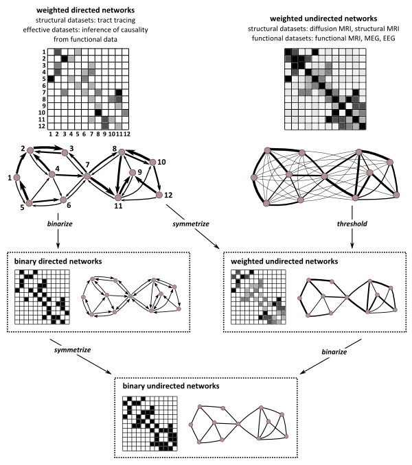

# Network analysis
## 1. Network construction

Steps:
1. Take absolute of the connectivity matrix 
2. Threshold connectivity matrix at given threshold, through either proportional thresholding or binned proportional thresholding

   A. Proportional thresholding (as implemented in BCT)
      - Gist: retain only the top t% of the weights in the matrix, where t is the threshold
      - Note: For issues with regard to proportional thresholding, see Martijn P. van den Heuvel et al. Proportional thresholding in resting-state fMRI functional connectivity networks and consequences for patient-control connectome studies: Issues and recommendations, NeuroImage, https://doi.org/10.1016/j.neuroimage.2017.02.005.
   
   B. Binned proportional thresholding 
      - Gist: retain only the weights in the bin from top t% to top t+increment% of weights
3. Transform into unweighted graph by binarizing graph (as implemented in BCT)
4. Fix common problems (as implemented in BCT): remove Inf and NaN, ensure exact binariness and symmetry (i.e. remove floating point instability), and zero diagonal.

_Figure from: Rubinov M, Sporns O (2010) NeuroImage 52:1059-69._

## 2. Network analysis

Steps:
1. Multiple networks are constructed for each subject, with different thresholds 
2. For each network, network measures are calculated (as implemented in BCT)
3. To compare between subjects over all thresholds, the AUC over all used thresholds is calculated for each network measure

Refrences:
1. Complex network measures of brain connectivity: Uses and interpretations. Rubinov M, Sporns O (2010) NeuroImage 52:1059-69.
2. van Assche M, Klug J, Dirren E, Richiardi J, Carrera E. Preparing for a Second Attack: A Lesion Simulation Study on Network Resilience After Stroke. Stroke. 2022;53:2038–2047. 
